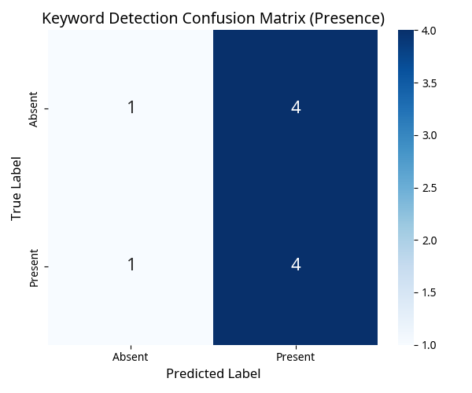

# Evaluation Report: Persistent Watching & Listening

This report summarizes the evaluation results for the Fall Detection and Keyword Detection components based on the Kaggle datasets.

## Fall Detection Results (Validation Split)

Processed 10 samples.

### Confusion Matrix:
```
          Predicted Not Fall | Predicted Fall
True Not Fall |          0      |         0     
   True Fall  |          3      |         7     
```


### Classification Metrics:
```
              precision    recall  f1-score   support

    Not Fall       0.00      0.00      0.00         0
        Fall       1.00      0.70      0.82        10

    accuracy                           0.70        10
   macro avg       0.50      0.35      0.41        10
weighted avg       1.00      0.70      0.82        10

```

## Keyword Detection Results

Processed 10 samples. Recognition failed for 0 samples.

### Confusion Matrix (Keyword Presence/Absence on Successful Recognitions):
```
          Predicted Absent | Predicted Present
True Absent   |          1      |         4     
True Present  |          1      |         4     
```



### Classification Metrics (Presence/Absence on Successful Recognitions):
```
              precision    recall  f1-score   support

      Absent       0.50      0.20      0.29         5
     Present       0.50      0.80      0.62         5

    accuracy                           0.50        10
   macro avg       0.50      0.50      0.45        10
weighted avg       0.50      0.50      0.45        10

```

