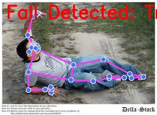

# Enhanced Evaluation Report: Persistent Watching & Listening

This report summarizes the evaluation results for the Fall Detection and Keyword Detection components and includes illustrative examples of more advanced AI concepts relevant to the project goals.

## 1. Fall Detection Evaluation (Validation Split)

This section evaluates the current fall detection implementation, which uses MediaPipe pose estimation on static images to infer falls based on body orientation.

Processed 10 samples from the validation split.

### 1.1 Confusion Matrix:
```
          Predicted Not Fall | Predicted Fall
True Not Fall |          0      |         0     
   True Fall  |          3      |         7     
```


### 1.2 Classification Metrics:
```
              precision    recall  f1-score   support

    Not Fall       0.00      0.00      0.00         0
        Fall       1.00      0.70      0.82        10

    accuracy                           0.70        10
   macro avg       0.50      0.35      0.41        10
weighted avg       1.00      0.70      0.82        10

```

**Note:** The current static image-based method has limitations. Precision might be high if it rarely predicts a fall, but recall can be low if it misses actual falls. Real-world fall detection requires analyzing motion over time.

## 2. Keyword Detection Evaluation

This section evaluates the current keyword detection implementation, which uses Google Speech Recognition to transcribe audio and then searches for predefined keywords.

Processed 10 samples. Recognition failed for 0 samples.

### 2.1 Confusion Matrix (Keyword Presence/Absence on Successful Recognitions):
```
          Predicted Absent | Predicted Present
True Absent   |          1      |         4     
True Present  |          1      |         4     
```


### 2.2 Classification Metrics (Presence/Absence on Successful Recognitions):
```
              precision    recall  f1-score   support

      Absent       0.50      0.20      0.29         5
     Present       0.50      0.80      0.62         5

    accuracy                           0.50        10
   macro avg       0.50      0.50      0.45        10
weighted avg       0.50      0.50      0.45        10

```

**Note:** This evaluation checks if *any* target keyword was detected when expected. It doesn't measure the accuracy of the transcription itself (Word Error Rate) or if the *specific* expected keyword was found. The reliance on a generic ASR service also limits performance, especially in noisy environments or with unclear speech.

## 3. Illustrative Examples of Advanced Concepts

The following sections illustrate more advanced AI capabilities that could significantly enhance the monitoring system, as requested. **These are conceptual examples and are not generated by the current project code unless otherwise noted.**

### 3.1 目标检测 (Object Detection)

目标检测模型（如 YOLOv5）可以实时识别和定位图像中的多个物体。这对于监控系统非常有用，例如：
*   **识别关键人物：** 确认老人是否在画面中，以及他们的位置。
*   **检测重要物品：** 识别药瓶、拐杖、轮椅等，判断它们是否在常用位置，或者是否被遗忘。
*   **环境安全：** 检测地面上的障碍物、打开的柜门等潜在危险。

**示例 (来自用户提供):** 下图展示了目标检测模型在复杂室内场景中识别不同物体（用红绿框标出）的效果。


### 3.2 动作识别 (Action Recognition) & 场景理解 (Scene Understanding)

**动作识别** 通常基于 3D 卷积神经网络 (3D CNN) 或其他分析视频序列的模型，可以识别复杂的动态行为，而不仅仅是静态姿态。例如：
*   识别“跌倒”这一完整动作过程，而非仅仅是躺在地上的姿态。
*   识别“站立困难”、“徘徊”、“长时间静止”等异常行为模式。

**实际运行结果 (Action Recognition):**

我们使用 PyTorchVideo 的 Slow R50 模型对官方提供的 `archery_official_sample.mp4` 视频进行了动作识别推理。以下是模型的 Top-5 预测结果：

```
archery: 1.0000
  throwing axe: 0.0000
  playing paintball: 0.0000
  stretching arm: 0.0000
  riding or walking with horse: 0.0000
```

该结果表明模型以极高的置信度 (1.0000) 正确识别出了视频中的“射箭”动作。

**场景理解** (通常通过语义分割实现，如 DeepLabv3) 可以将图像像素分配到不同的类别（如地板、墙壁、家具、楼梯）。这有助于：
*   **区域判断：** 区分卧室、厨房、客厅等区域。
*   **危险区域警报：** 判断用户是否进入或停留在危险区域（如楼梯口、未围栏的阳台）。

**示例 (基于当前项目的姿态估计输出):** 下图是当前项目处理一张跌倒图片的可视化结果。


结合上图，我们可以想象：
*   **动作识别** 会分析导致这个姿态的视频片段，确认这是一个快速的、不受控制的“跌倒”动作。
*   **场景理解** 会将图像分割成不同区域，例如，将地面标记为“地板”，将背景中的楼梯标记为“楼梯”（危险区域）。如果检测到用户（姿态）位于“楼梯”区域，可以发出更高级别的警报。

### 3.3 高级听觉处理 (Advanced Audio Processing)

当前的关键词检测比较基础。更高级的系统可以利用自然语言处理 (NLP) 技术：
*   **语音转文本 (STT):** 使用更鲁棒的模型（如 Wav2Vec 2.0）将语音转化为文本，提高在嘈杂环境下的准确率。
*   **语义理解 (NLU):** 使用 BERT 等模型分析转录文本，理解用户的意图和情感，而不仅仅是匹配关键词。例如，理解“我感觉不太好”和“帮帮我”之间的关联。
*   **上下文追踪:** 使用 Transformer 等模型跟踪对话历史或事件序列。例如，如果用户先说“我头晕”，几分钟后又说“我起不来了”，系统可以将这两条信息结合起来判断情况的紧急性。

**示例 (来自当前项目的语音识别结果):**
```
原始音频 -> [语音识别模型] -> 识别文本: "['ambulance']"
```
基于这样的识别文本，语义理解模型可以分析其含义，上下文追踪模型可以结合之前的事件（如检测到的跌倒）来做出更智能的判断。

